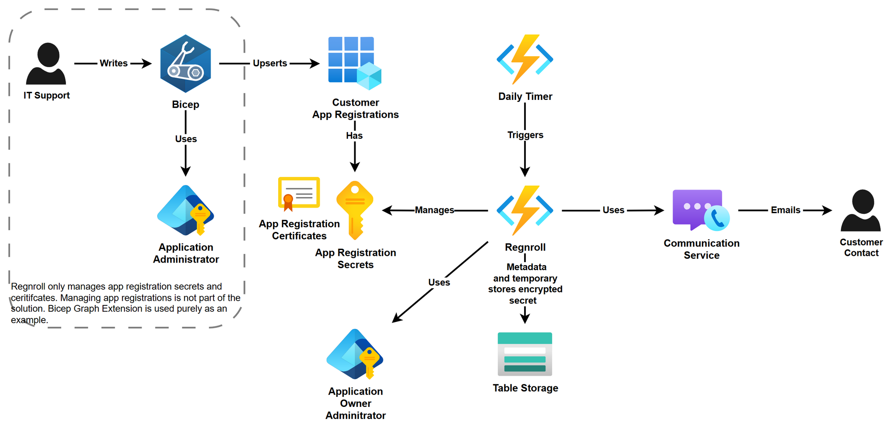
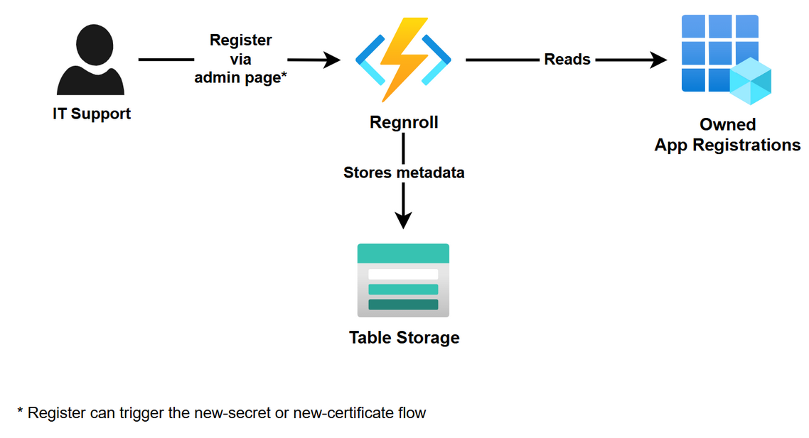
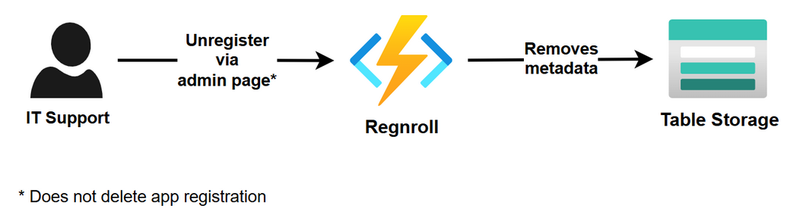
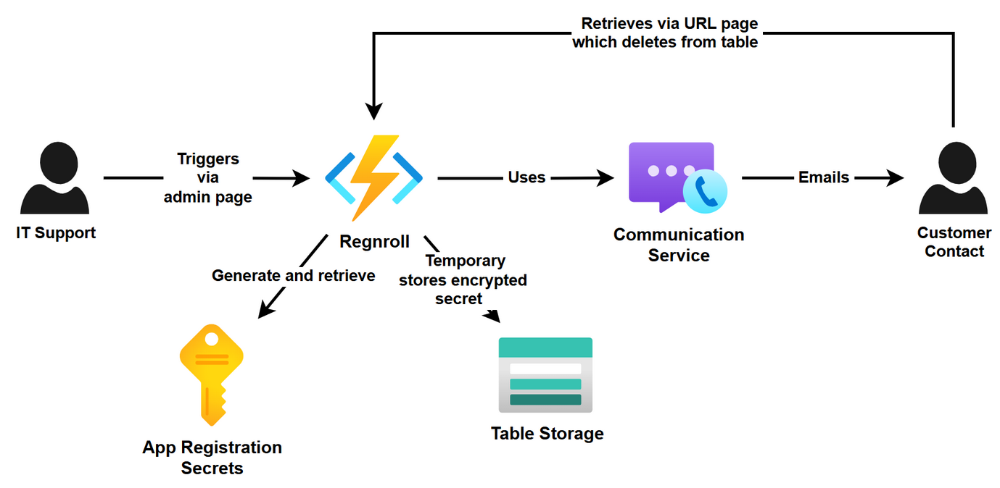
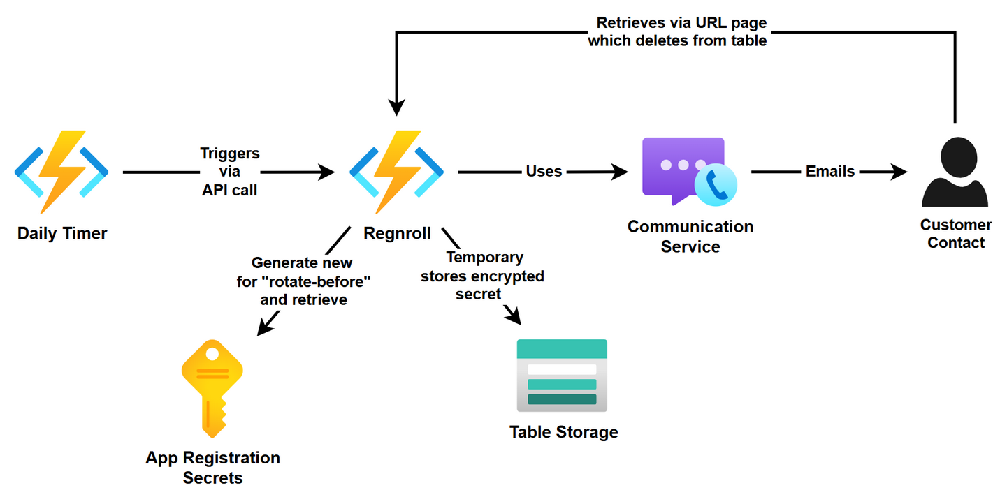
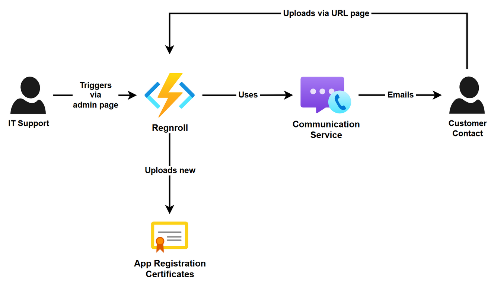
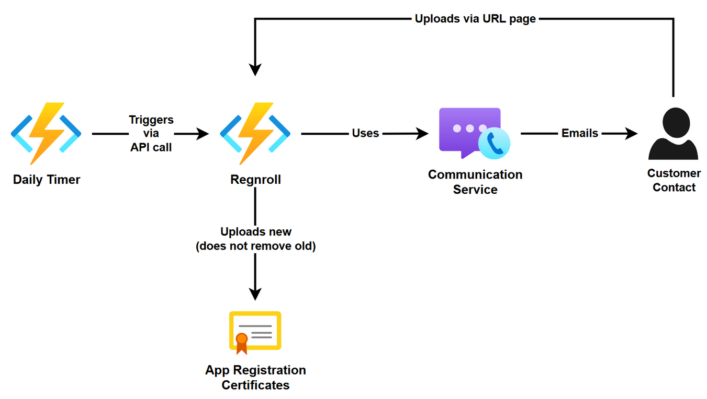
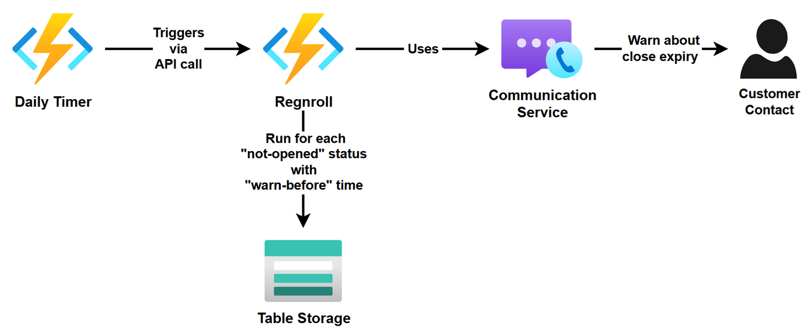
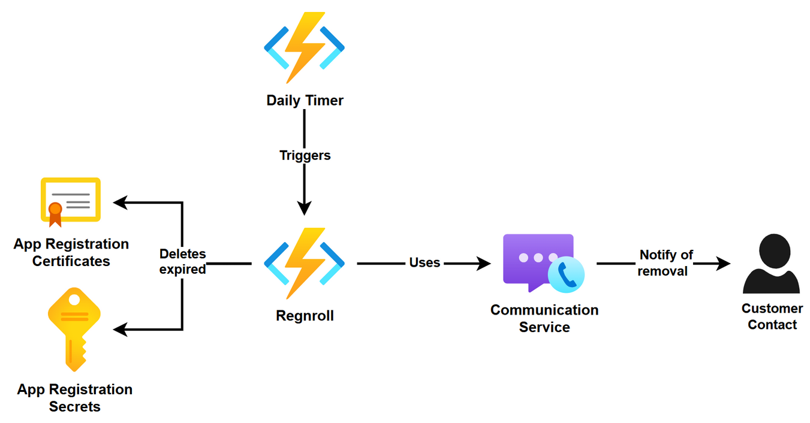
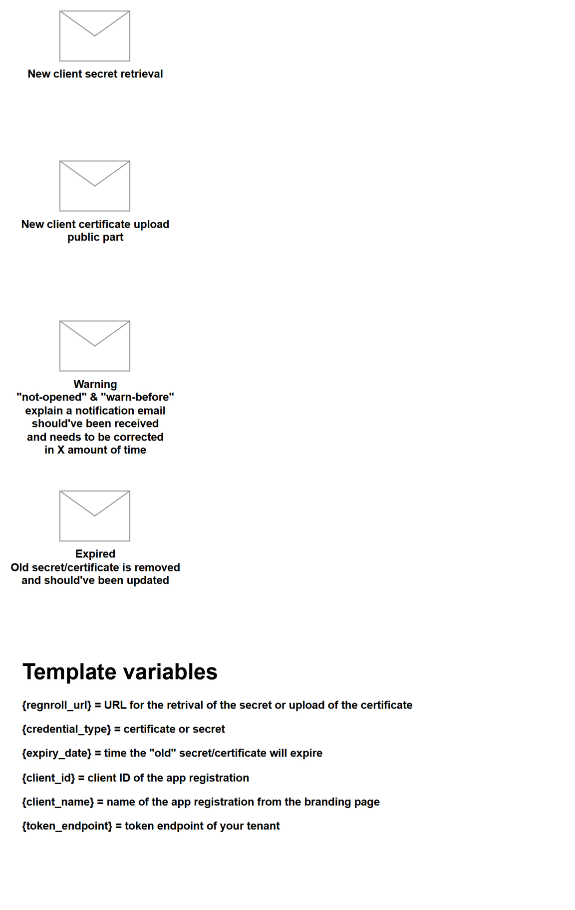

Regnroll is a single Azure Functions app (Flex Consumption, .NET isolated) plus a dedicated data storage account, Azure Communication Services for email, and Microsoft Graph via managed identity. The architecture follows [acmebot](https://github.com/polymind-inc/acmebot) (function-hosted minimal UI, EasyAuth, IaC-first); the delivery logic follows [yopass](https://github.com/jhaals/yopass) (encrypted-only storage, one-time links).

Regnroll only manages app registration **secrets and certificates** — creating the app registrations themselves stays in your IaC (the Bicep Graph extension in the diagram is just an example).

## Registering and unregistering

IT support links an app registration in the admin portal; Regnroll reads the identity's owned app registrations and stores metadata (contact, overrides) in Table Storage. Registering can immediately trigger the first secret or certificate flow.

Unregistering removes only Regnroll's metadata — never the app registration:

## Secret flows

A manual trigger (or registration) creates a new client secret, stores it **encrypted only**, and emails a one-time retrieval link; the customer's claim deletes the ciphertext:

The daily timer does the same automatically when the latest secret enters its rotate-before window:

## Certificate flows

Certificates travel the other way — the customer generates the key pair and uploads only the public part, which Regnroll adds via Graph without removing the old certificate:

## Warnings and expiry

Links still "not opened" within the warn-before window trigger one reminder email:

Credentials past expiry are removed (they are cryptographically dead at that point) and the customer is notified:

## Email templates

All four notifications are template-driven and customizable in the portal:

## Code layout

| Path | Contents |
| --- | --- |
| `Functions/Http/` | One class per endpoint group: public pages, claim, upload, admin APIs |
| `Functions/Timer/DailyLifecycleScan.cs` | The daily driver |
| `Services/` | `DeliveryService` (flows), `LifecycleService` (scan), `GraphAppService`, `LinkStore`/`MetadataStore` (tables), `TemplateService`, `AcsEmailSender`, `CryptoService` |
| `Infrastructure/` | `AdminAuth` (EasyAuth principal, fail-closed), `StaticFiles`, `StorageInitializer` |
| `wwwroot/` | Hand-written admin portal + public pages (no frontend build step) |
